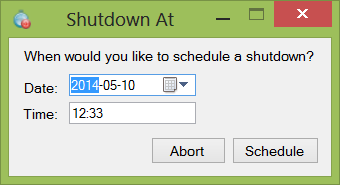

Shutdown-At
===========

Simple program which schedules a computer shutdown at the specified time.

This program was created since Windows 8 removed the at command line program, which I used to schedule shutdowns on my computer. 
Since the schtasks syntax is much more complex, I decided to make a small program for the task. Makes use of schtasks.

Since the program shuts down your computer, it needs to be run as administrator.

